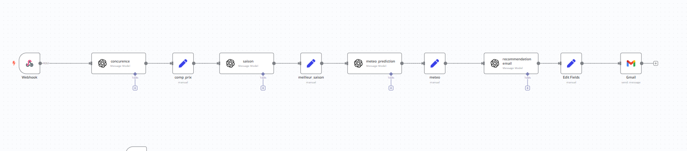
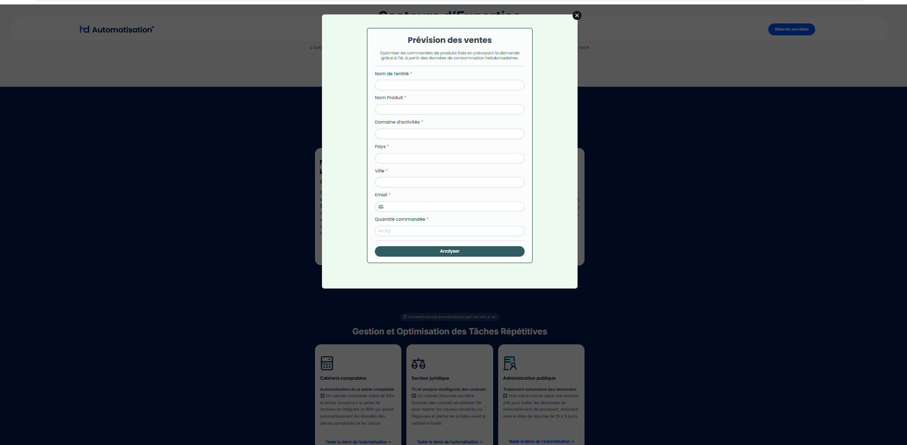

# 🛒 Analyse IA pour la Prévision des Ventes en Grande Distribution

Ce projet vise à assister les professionnels de la grande distribution dans l’optimisation de leurs commandes de produits frais en analysant automatiquement plusieurs facteurs clés : saisonnalité, météo, concurrence, et quantité optimale. Il est basé sur une automatisation complète avec **n8n** et l’intégration d’agents IA via OpenAI.

## 🔧 Technologies utilisées

- 🧠 Agents IA (OpenAI GPT)
- 🔄 [n8n](https://n8n.io) pour les workflows automatisés
- 📩 Gmail API pour l’envoi des recommandations
- 🧾 Intégration du formulaire via **HD Automatisation**
- ☁️ Analyse météo et saisonnalité dynamique

## 📸 Aperçus du projet

### 🧩 Workflow automatisé avec n8n

### 🧾 Formulaire de saisie HD Automatisation

---

## 🧠 Exemple de Résultat Automatisé

> Analyse de votre commande de **TOMATES**  
> **Quantité demandée :** 150 kg  
> **Quantité suggérée :** 120 kg  

**💰 Analyse Tarifaire**  
| Concurrent         | Prix        |
|-------------------|-------------|
| Aswak Assalam     | 10 MAD/kg   |
| Marjane           | 9 MAD/kg    |
| Carrefour Market  | 10 MAD/kg   |
| **Prix moyen**     | **10 MAD/kg** |
| **Notre prix proposé** | **9.5 MAD/kg** |

**🌱 Saison :** Été  
**🌤️ Météo :** 38°C – Conditions défavorables

### 📋 Analyse détaillée

- **Météo :** Risques pour le transport et le stockage des produits frais, prévoir des mesures de protection.  
- **Saison :** Bonne disponibilité mais qualité variable selon la météo.  
- **Recommandation :** Ajustement de la commande conseillé.

---

## 🚀 Fonctionnalités à venir

- Intégration automatique des données météo en temps réel via API  
- Tableau de bord analytique en ligne  
- Historique des analyses pour chaque client

## 🧑‍💼 Auteur

Projet réalisé par [Ton Nom / Ton Organisation]  
Avec intégration IA + automatisation low-code grâce à **n8n** & **HD Automatisation**

---

## 📄 Licence

Ce projet est sous licence MIT. Voir le fichier [LICENSE](LICENSE) pour plus d’informations.
